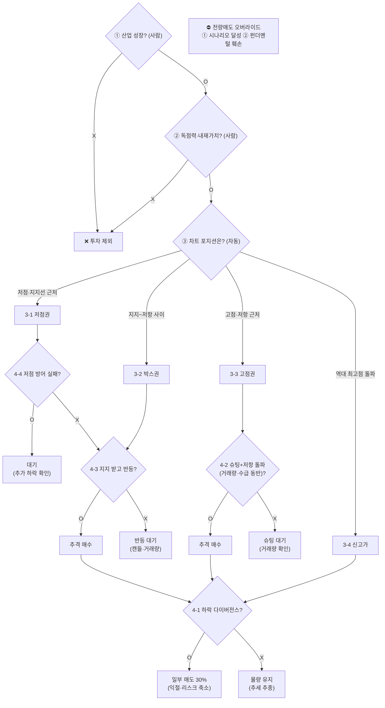

# 에이전트 통합 매매 전략 (1~8장)

> [!abstract] 목적
> 박두환 1~8장을 **하나의 의사결정 엔진**으로 통합. [[7. 흔들리지 않는 매매 기준 수립|7장 4단계 알고리즘]]을 뼈대로, 차트(2~4장)·수급(6장)·매도(8장) 룰을 결합.
> 설계 원칙: **계산·판정은 코드, 시나리오 판단은 사람.** 입력 = 워치리스트(사람이 선정), 출력 = 종목별 **국면 판정 + 권장 액션 + 근거**.

---

## 0. 역할 분담 (자동 vs 사람)

| 영역 | 담당 | 비고 |
|------|------|------|
| 산업 성장성 (단계1) | 🧑 **사람** | 메가트렌드·정책·TAM 판단 |
| 기업 독점력·시나리오 (단계2) | 🧑 **사람** (+ 일부 재무 자동) | 해자·시나리오는 사람 / ROIC·FCF·매출추세는 자동 보조 |
| 차트 포지션 (단계3) | 🤖 **자동** | OHLCV로 계산 |
| 실행 신호 (단계4) | 🤖 **자동** | 다이버전스·돌파·반등·거래량 |
| 수급 확증 (6장) | 🤖 **자동** | 외국인/기관/개인 누적 순매수 |
| 매도·포지션 운영 (8장) | 🤖 자동 신호 + 🧑 실행 | 30% 분할익절 신호 / 전량매도는 사람 확인 |
| 포지션 사이징·리밸런싱 | 🧑 사람 | → [[내 포트폴리오 운용 원칙]] |

> [!important] 게이트 원칙
> 단계1·2(펀더멘털)는 **통과/탈락 게이트**. 사람이 워치리스트에 넣었다는 것 = 게이트 통과로 간주. 에이전트는 **단계3·4(타이밍)부터 자동 수행**하되, 단계2의 정량 지표(ROIC>WACC, FCF, 매출)는 **훼손 감시**용으로 계속 모니터링.

---

## 1. 메인 의사결정 엔진 (7장 4단계)

> [!warning] 전량매도 오버라이드 (8장 6번)
> 위 흐름과 **무관하게**, ① 목표 내재가치 실현 또는 ② 펀더멘털 훼손이면 **전량 매도(편출)**. 이 둘만이 '마침표', 나머지 매도는 모두 '쉼표(부분 매도)'.

---

## 2. 단계3 — 차트 포지션 분류 (자동)

먼저 캔들·추세·이평선을 계산해 **현재 포지션을 4개 중 하나로 분류**.

| 포지션 | 판정 조건 | → 실행 |
|--------|----------|--------|
| **3-1 저점권** | 장기 이평선/주요 추세선 지지 테스트 + 하락멈춤 캔들 + 매도 거래량 위축 | → 4-4 |
| **3-2 박스권** | 지지~저항 사이 횡보, 변동성 수축, 중립 추세 | → 4-3 |
| **3-3 고점권** | 강력 저항 매물대 테스트, 거래량 증가 주시 | → 4-2 |
| **3-4 신고가** | 역사적 신고가 돌파 + 대량 거래량 + 상단 매물 없음 | → 4-1 |

### 계산 기준 (→ [[룰 요약. 차트 분석 (2·3장)]])
- **추세/구조**: 고점·저점 동시 방향 → 상승/하락/횡보. **Higher Low** = 상승 구조 핵심
- **이평선**: 20/60/120일 SMA. **진짜 골든크로스 = 120일선 상승 중** 교차
- **캔들**: 망치형(아래꼬리 ≥ 몸통×2~3) / 유성형(위꼬리 ≥ 몸통×2~3) / 도지(몸통≈0)
- **매물대(지지·저항)**: 거래량 집중 가격대

---

## 3. 단계4 — 실행 신호 (자동)

| # | 신호 판정 | O → 액션 | X → 액션 |
|---|----------|----------|----------|
| **4-1** | [[용어. RSI (상대강도지수)\|RSI]] **하락 다이버전스** (가격 고점↑ & RSI 고점↓) | 일부 매도 30% | 물량 유지 |
| **4-2** | 저항 돌파 + **거래량 폭발(평소 5~10배)** + 수급 동반 | 추격 매수 → 4-1 | 거래량 나올 때까지 대기 |
| **4-3** | 지지 도달 + **망치형** 등 반등 캔들 + 거래량 | 추격 매수 → 4-1 | 반등 신호 대기 |
| **4-4** | 저점 방어 실패 = **저점 하향 갱신** | 대기(추가 하락 확인) | 4-3으로 (반등 대기) |

> [!tip] 다이버전스 시간프레임
> 일봉보다 **주봉·월봉** 다이버전스가 훨씬 강한 신호. 큰 프레임 우선.

---

## 4. 수급 확증 레이어 (6장, 자동)

단계4 신호에 **수급을 겹쳐** 신뢰도를 높인다. (외국인/기관/개인 누적 순매수 = 증권 API)

> [!check] 수급 3문장
> ① 외국인 방향? (모으나/던지나) · ② 1/3/6개월 **누적 순매수** 흐름? · ③ 돌파·방어 시 **거래량** 충분?

| 수급 패턴 | 구조 | 시사점 |
|-----------|------|--------|
| 🕳️ 기회의 틈(바닥) | 외인 매수 + 개인 매도 | 매수 우호 (4-3/4-4 강화) |
| 🚀 로켓 점화 | 외인+기관 동시 매수 | **홀딩 강화** (4-1 X 쪽) |
| 🔥 탐욕의 끝(천장) | 외인 매도 + 개인 매수 | **일부 익절** (4-1 O 강화) |
| 🐱 데드캣 | 외인 매도 + 개인/기관 매수 | 반등 신뢰 ↓ (4-3 보류) |
| 🔄 구조 전환 | 외인 이탈 후 기관 주도 매수 | 턴어라운드 관찰 (외인 재진입 확인) |

> [!important] 결합 규칙
> **돌파·반등 신호(4-2/4-3)는 외국인 매수 또는 누적 순매수 우상향이 동반될 때만 '확증'.** 거래량 없는 돌파/반등은 가짜로 간주(보류).

---

## 5. 매도·포지션 운영 (8장)

> [!quote] 철학
> 매도의 목적은 가격 차익이 아니라 **수량 증대 + 심리 안정**. 매도는 마침표가 아니라 쉼표.

- **부분 매도 = 기본**: 과열 확인 시 보유의 **약 30%** 분할 익절 → 현금 버퍼 확보
- **코어 70% 보호**: 펀더멘털·시나리오 유지 시 홀딩, 추세 끝까지
- **현금 버퍼 활용**: 차기 조정 시 더 싸게 재매수 → 총수량 증대(복리)
- **전량 매도 = 2경우만**: ① 시나리오 달성 ② 펀더멘털 훼손
- **복기 지표**: 사이클 대비 **보유 주식 수량 증가** 추적 (복리 작동 증명)

### 과열 신호 (= 4-1 트리거)
RSI 하락 다이버전스 + 외국인 매도 전환 + 개인 광기 매수 쏠림 → **다각도 동시 점검**.

---

## 6. 에이전트 입출력 사양

> [!example] 입력
> - **워치리스트**: 사람이 단계1·2 통과시킨 종목 + 각 종목의 **목표 내재가치(시총/영업이익)**·시나리오 가정
> - **시장 데이터**: OHLCV(일/주/월봉), 거래량, 외국인/기관/개인 순매수 — 증권 API(KIS Open API / pykrx)

> [!example] 출력 (종목별)
> 1. **현재 포지션**: 3-1~3-4 중 분류
> 2. **권장 액션**: 매수/추격매수/홀딩/일부매도(30%)/대기/전량매도 + 이유
> 3. **근거**: 캔들·추세·거래량·RSI·수급 신호의 **중첩 정도** (중첩 많을수록 강한 신호)
> 4. **경보**: 펀더멘털 정량지표(ROIC·FCF·매출) 훼손 또는 저점 하향 갱신 시 알림

---

## 7. 구현 메모 & 경계

- **데이터 연결**: 증권 API를 **MCP 서버**로 감싸 도구화 (`종목코드 → OHLCV/수급`)
- **단계별 우선순위**: 펀더멘털 게이트(사람) → 포지션 분류 → 실행 신호 → 수급 확증 → 매도/사이징
- **분할 진입/청산** 기본, 진입 전 **손절 기준 사전 설정**, 단일 종목 비중 한도 준수 → [[내 포트폴리오 운용 원칙]]

> [!danger] 경계
> - "내재가치 시나리오"는 **사람 입력 필수** — 자동화/환각 금지 영역
> - 패턴 인식(삼각수렴·쐐기 등)은 애매 → LLM 보조 해석, 단정 금지
> - ⚠️ **분석 보조 도구**이며 투자 권유·자동매매가 아님. 신호는 확률일 뿐 보장 아님

---

## 부록: 9장(실전 사례)
> [!note]
> 9장은 케이스 스터디라 별도 정리 생략. 위 엔진을 실제 종목에 적용·검증하는 단계에서 참고.
